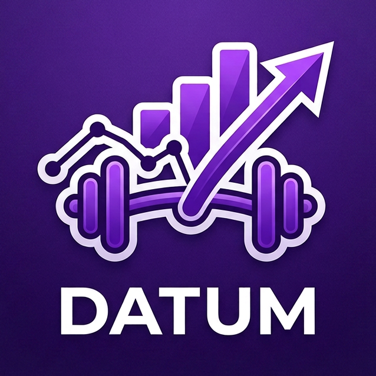
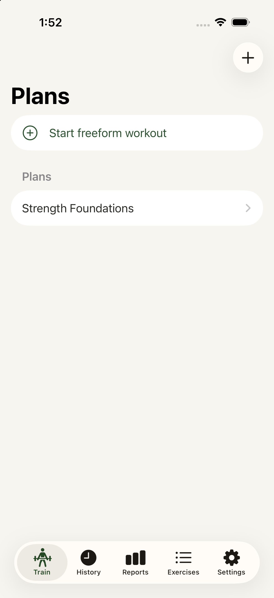
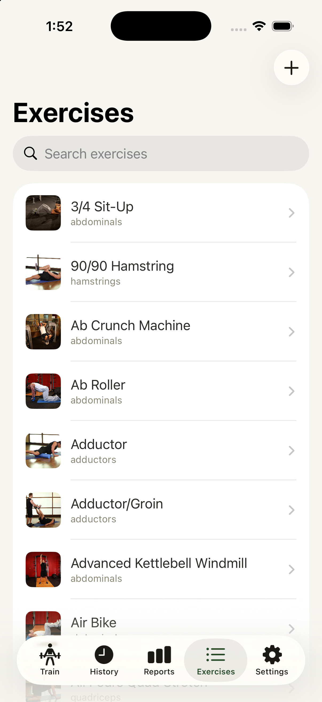
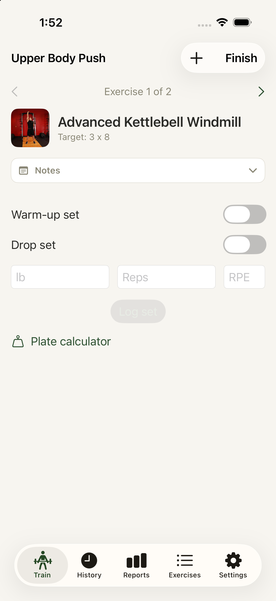
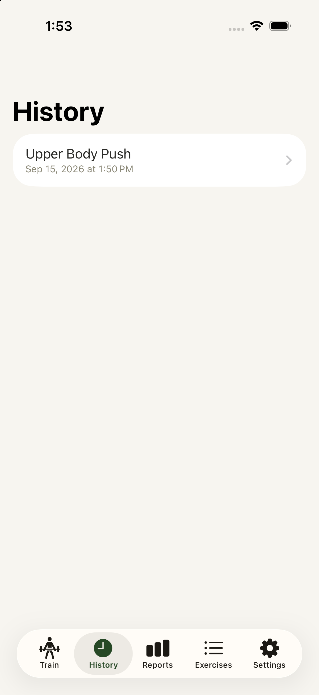
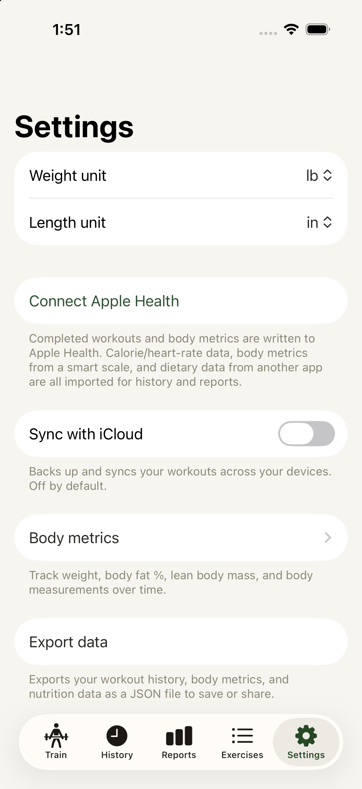
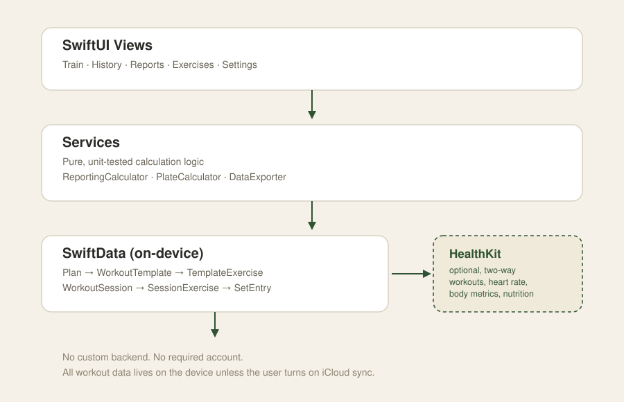

# Datum

**A native iOS workout tracker for people who want to log lifts and see real progress — no account, no social feed, no subscription nag on day one.**

> This is a showcase repository. It documents the product and shows what it looks like — the private source repository is not included here. See [Current status](#current-status) and the note at the bottom for access.

## Overview

Datum is a native Swift/SwiftUI iOS app for planning workouts, logging sets in the gym, and tracking progress over time. It's built for lifters who want a serious, data-first tracker: build a plan, log a session set-by-set, and see personal records, estimated 1-rep max, and training volume trend out the other side — with two-way Apple Health sync and everything stored on-device.

## The problem it solves

Most workout-tracking apps fall into one of two camps: bloated social platforms built around feeds and challenges, or bare-bones loggers that don't do anything with the data once it's captured. Datum is aimed at the person in between — someone who wants to plan a real training program, log it quickly mid-set, and actually see whether they're getting stronger, without an account wall or a data model built for engagement metrics instead of training metrics.

## Key features

- **Plans & templates** — build a plan containing multiple workout templates; start a session from a template or go fully freeform, picking exercises as you go
- **Set-by-set logging** — weight, reps, and optional RPE per set, with the prior session's numbers for that exercise shown live as a goal
- **Warm-ups, drop sets & supersets** — all three set types are first-class, not an afterthought, and are handled correctly in every downstream calculation (PRs, 1RM, volume)
- **Exercise library** — seeded with 873 exercises (instructions, muscle groups, equipment, photos) plus custom exercise creation with your own photos and muscle-group tagging
- **Reporting engine** — auto-detected personal records, estimated 1-rep max trend, volume by muscle group, body-weight trend, and cross-metric correlation charts (training volume × body composition, protein intake × lean mass, and more)
- **Apple Health integration** — two-way sync: completed workouts, heart rate, and calories write out to Health; body metrics and dietary data read back in
- **Body metrics tracking** — weight, body fat %, lean body mass, and body measurements (waist, arms, chest, thighs, calves, neck), synced with Health where a matching data type exists
- **Plate calculator** — per-side plate breakdown for a target weight, right on the logging screen
- **Configurable rest timer**, workout notes, and a JSON data export you can save or share
- **On-device by default** — no required account, no custom backend; iCloud sync is an opt-in setting, not a dependency

## Screenshots

*All screens below show either the seeded public exercise library or sample data created for this screenshot set — no real personal training data is shown.*

| | |
|---|---|
|  |  |
| Plans & templates | Exercise library (873 seeded exercises) |
|  |  |
| Active workout logging | Workout history |
|  | |
| Settings — Health sync, units, body metrics, export | |

## Tech stack

- **Swift & SwiftUI**, targeting iOS 18+, iPhone only for v1
- **SwiftData** for on-device persistence — no ViewModel layer; views bind directly via `@Query`/`@Bindable`
- **HealthKit** as the only external health/device integration (no direct third-party wearable SDKs)
- **XcodeGen** to generate the Xcode project from a single `project.yml` source of truth
- **XCTest + XCUITest** — a fast unit-test suite for pure calculation logic, plus an end-to-end UI smoke test covering the full plan → log → history loop

## Architecture

Datum has no custom backend. Views read and write SwiftData directly; a thin `Services` layer holds the pure, unit-tested logic (reporting math, the plate calculator, data export, HealthKit sync) that doesn't belong in a view. HealthKit sync is optional and one layer removed from the core data model — the app works fully offline with it turned off.

The core data model is a simple chain: a `Plan` contains `WorkoutTemplate`s, each with target exercises/sets/reps/weight. Starting a workout **snapshots** the template's exercises into a `WorkoutSession` at that moment, rather than staying live-linked to it — so editing a template later never rewrites the history of a session that already happened.

## My role

I'm a technology leader focused on AI enablement, and Datum is a personal project I use to stay hands-on with what AI-assisted development can actually do end to end — not just autocomplete, but planning, architecture decisions, and test coverage. I directed the product and design decisions (what to build, the data model shape, the visual direction, what to defer) and reviewed every change; the implementation itself was written by Claude Code. I'm not claiming this as hand-written software engineering — it's a real, working iOS app built through AI-assisted development, and I think that distinction matters.

## Current status

**In active development.** The core loop — build a plan, log a workout set-by-set, see it in history — works end to end and is covered by an automated UI test, not just "it compiles." HealthKit sync, the reporting engine, warm-ups/drop-sets/supersets, body metrics, and data export are all built and working. Still open: a free/paid tier split, progress photos, CloudKit sync (attempted, paused), an Apple Watch companion, and a few smaller v1 backlog items. Nothing here is vaporware — everything described above and shown in the screenshots is running in the simulator today.

---

Source available on request.
